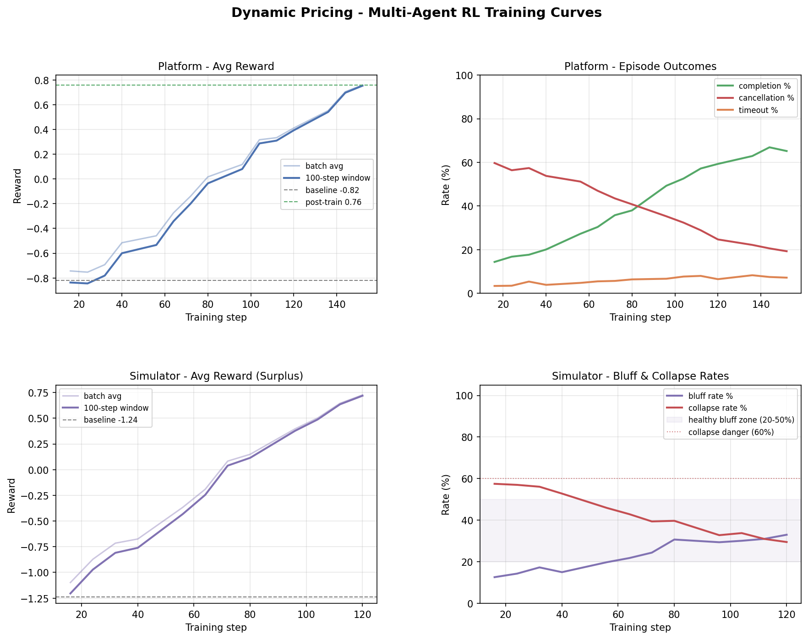

# Ride-Hailing Dynamic Pricing — OpenEnv Environment

A multi-step negotiation environment where an AI agent acts as a **ride-hailing platform**, proposing prices each round to a rider and a driver who independently accept or reject. The agent must find a price both parties agree on — quickly, profitably, and without anyone walking away.

## System Architecture


---

## Table of Contents

- [The Problem](#the-problem)
- [How a Negotiation Works](#how-a-negotiation-works)
- [What the Agent Sees (Observation Space)](#what-the-agent-sees-observation-space)
- [What the Agent Does (Action Space)](#what-the-agent-does-action-space)
- [How Scenarios Are Generated](#how-scenarios-are-generated)
- [Reward Design](#reward-design)
- [Grading & Pass/Fail Criteria](#grading--passfail-criteria)
- [Task Difficulties](#task-difficulties)
- [Multi-Agent RL Training](#multi-agent-rl-training)
- [Training Results](#training-results)
- [Policies (Agents)](#policies-agents)
- [Project Structure](#project-structure)
- [Setup & Usage](#setup--usage)

---

## The Problem

A rider wants to go somewhere. A driver can take them. The rider has a maximum price they would pay; the driver has a minimum price they would accept. These **true willingness thresholds are hidden** — the agent only sees their quoted prices (which are more conservative).

The platform must propose a price each round. Both parties independently accept or reject based on their hidden thresholds. If either party runs out of patience after repeated bad proposals, they **cancel** and the deal is lost. If the maximum number of negotiation rounds is exhausted, the episode **times out**.

Real-world context factors — weather, traffic, demand/supply levels, surge pricing, time of day — influence the hidden thresholds, adding asymmetry to the negotiation.

---

## How a Negotiation Works

```
Episode Start
  │
  ├── Scenario generated (rider quote, driver quote, hidden thresholds, context)
  │
  ├── Round 1: Agent proposes $X
  │     ├── Rider: accept if price ≤ rider_max_willingness
  │     ├── Driver: accept if price ≥ driver_min_willingness
  │     └── Both accept → Ride Completed ✓
  │         Either rejects → patience decreases, move to next round
  │         Patience hits 0 → Cancelled ✗
  │
  ├── Round 2: Agent proposes $Y (informed by previous feedback)
  │     └── ...
  │
  └── Round N (max_steps): No agreement yet → Timed Out ✗
```

Key mechanics:
- **Deterministic acceptance**: Thresholds (`rider_max_willingness`, `driver_min_willingness`) are fixed at scenario generation time — no per-step noise. The same price always produces the same accept/reject outcome within an episode.
- **Patience decay**: Each rejection reduces that party's patience. At 0 → cancellation.
- **Mood**: Derived from patience — "willing" (>0.6), "hesitant" (0.3–0.6), "frustrated" (<0.3).
- **Duplicate price guard**: Re-proposing the same price is rejected without advancing the step counter, forcing the agent to explore.

---

## What the Agent Sees (Observation Space)

Each round, the agent receives:

| Field | Type | Description |
|-------|------|-------------|
| `rider_quoted_price` | float | Rider's stated maximum (conservative — true willingness is higher) |
| `driver_quoted_price` | float | Driver's stated minimum (conservative — true willingness is lower) |
| `price_gap` | float | Absolute difference between quotes |
| `distance_km` | float | Trip distance |
| `estimated_duration_min` | float | Estimated trip duration |
| `pickup_eta_min` | float | Estimated pickup time |
| `demand_level` | int (0–2) | Low / Medium / High |
| `supply_level` | int (0–2) | Low / Medium / High |
| `surge_multiplier` | float (1.0–3.0) | Current surge pricing factor |
| `weather_condition` | int (0–2) | Clear / Rain / Storm |
| `traffic_level` | int (0–2) | Low / Medium / Heavy |
| `time_of_day` | int (0–3) | Morning / Afternoon / Evening / Night |
| `day_type` | int (0–2) | Weekday / Weekend / Holiday |
| `commission_rate` | float | Platform's commission percentage |
| `operational_cost` | float | Platform's per-ride cost |
| `max_steps` | int | Maximum negotiation rounds |
| `step_number` | int | Current round number |
| `rider_patience` | float (0–1) | Rider's remaining patience |
| `driver_patience` | float (0–1) | Driver's remaining patience |
| `rider_mood` | string | "willing" / "hesitant" / "frustrated" |
| `driver_mood` | string | "willing" / "hesitant" / "frustrated" |
| `last_rider_response` | string | "accepted" / "rejected" / null |
| `last_driver_response` | string | "accepted" / "rejected" / null |
| `last_proposed_price` | float | Previous price proposal (null on first step) |

**Crucially absent**: The rider's true maximum willingness and the driver's true minimum willingness. The agent must infer the acceptable price range from indirect signals and rejection feedback.

---

## What the Agent Does (Action Space)

```json
{"type": "propose_price", "payload": {"price": 18.50}}
```

A single action type — propose a price. The entire strategy is about *which* price to propose given the current feedback and context.

---

## How Scenarios Are Generated

Each episode creates a fresh negotiation scenario via `ScenarioGenerator`:

1. **Base price** computed from trip fundamentals: `3.0 + 1.5 × distance + 0.3 × duration`
2. **Context adjustments** modify pricing: bad weather increases both quotes, high demand raises rider tolerance, low supply raises driver expectations, etc.
3. **Rider quote** (lower) and **driver quote** (higher) are derived from the base price with a task-specific gap.
4. **Hidden willingness** extends beyond quotes by a slack amount:
   - Rider's true max = `rider_quote + slack`
   - Driver's true min = `driver_quote - slack`
5. **Noise baked in at generation time**: A `rider_noise_bound` is sampled once per scenario from the task's `acceptance_noise_range`. This is added to the hidden thresholds *once*, making acceptance fully deterministic within an episode while preserving scenario-to-scenario variability.
6. **Per-scenario thresholds** computed and stored in `HiddenState`:
   - `reward_threshold` = fraction of the maximum possible profit for that scenario
   - `penalty_threshold` = fraction of the `rider_noise_bound` (more unpredictable rider → more lenient penalty threshold)

---

## Reward Design

The reward function balances three competing objectives: **close the deal**, **close it fast**, and **close it profitably**.

### Per-Step Shaping Rewards

| Outcome | Reward | Signal |
|---------|--------|--------|
| One party accepts, other rejects | **+0.05** | Price is acceptable to one side |
| Both reject | **−0.05** | Price is off for everyone |
| Both accept | 0.0 | Terminal reward takes over |

### Terminal Rewards

**Ride completed** (both accept):

```
platform_profit        = price × commission_rate − operational_cost
efficiency_bonus       = min(max_steps / steps_taken, 3.0)
missed_revenue_penalty = max(0, rider_max_willingness − price) × commission_rate
reward = platform_profit × efficiency_bonus − missed_revenue_penalty
```

The `missed_revenue_penalty` penalizes leaving money on the table — if the rider would have accepted a higher price, the platform lost that revenue by pricing too low.

The `efficiency_bonus` rewards closing quickly — an 8-step task solved in 2 steps earns a 3.0× multiplier (capped).

**Timed out**: **−2.0**

**Cancelled**: **−5.0** — penalized more harshly because it means the agent actively drove a party away.

---

## Grading & Pass/Fail Criteria

Each episode is independently evaluated as **pass or fail** based on three conditions:

```
episode_passed = (
    ride_completed == True
    AND episode_reward > reward_threshold
    AND missed_revenue_penalty < penalty_threshold
)

raw_score = total_passed / num_episodes
score     = sigmoid(raw_score)           # strictly in (0, 1)
```

Both thresholds are **scenario-specific** — computed from the `HiddenState` at generation time:

- `reward_threshold`: A minimum profit bar scaled to what was achievable in that scenario.
- `penalty_threshold`: A cap on how much revenue the agent is allowed to leave on the table.

The sigmoid mapping (`1 / (1 + exp(-(raw * 12 - 6)))`) guarantees the final score is never exactly 0.0 or 1.0, as required by the OpenEnv platform.

### Threshold Fractions by Task

| Task | Reward Threshold | Penalty Threshold |
|------|-----------------|-------------------|
| Easy | 30% of max profit | 100% of noise bound |
| Medium | 50% of max profit | 75% of noise bound |
| Hard | 70% of max profit | 50% of noise bound |

---

## Task Difficulties

| Parameter | Easy ("Friendly Market") | Medium ("Rush Hour") | Hard ("Storm Surge") |
|-----------|--------------------------|----------------------|----------------------|
| Max steps | 8 | 5 | 4 |
| Price gap | $6–14 | $10–18 | $12–22 |
| Initial patience | 0.85–1.0 | 0.75–0.95 | 0.55–0.85 |
| Patience decay / rejection | 0.08–0.14 | 0.12–0.22 | 0.18–0.35 |
| Acceptance noise range | $1.0–2.5 | $1.5–3.0 | $2.0–4.0 |
| Surge multiplier | 1.0–1.3 | 1.1–2.0 | 1.5–3.0 |
| Reward threshold fraction | 30% | 50% | 70% |
| Penalty threshold fraction | 100% | 75% | 50% |

Harder tasks have: fewer negotiation rounds, larger price gaps, lower patience, faster patience decay, more noise, and a stricter profit bar to pass.

---

---

## Multi-Agent RL Training

This environment is paired with a full multi-agent RL training pipeline that trains two LLMs in a cooperative-competitive loop:

| Agent | Model | Role |
|---|---|---|
| **Platform LLM** | Qwen2.5-1.5B-Instruct + LoRA r=16 | Proposes prices to maximise profit |
| **Simulator LLM** | Qwen2.5-0.5B-Instruct + LoRA r=8 | Plays rider + driver, learns strategic bluffing |

**Training algorithm:** Manual GRPO (Group Relative Policy Optimization) — group-relative advantage normalisation over collected (prompt, completion, reward) tuples. TRL's `GRPOTrainer` was not used because it cannot interleave with stateful multi-turn `env.step()` calls; the math is equivalent.

**Efficiency:** Unsloth 4-bit quantization + `FastLanguageModel.for_inference()` on frozen models for ~2× rollout speedup.

### Training Arc

```
Phase 2: Platform v0  trained vs  rule-based simulator
              ↓
Phase 3: Simulator v1 trained vs  frozen Platform v0
              ↓
Phase 4: Platform v1  trained vs  frozen Simulator v1
```

Each phase freezes one model and trains the other — controls non-stationarity in the two-player game.

### Reward Design (7 independent signals)

| Signal | Where | Purpose |
|---|---|---|
| Terminal reward | `reward.py` | Efficiency-adjusted platform profit |
| Step shaping | `reward.py` | Partial accept / double reject signals |
| Process reward | `reward.py` | Directional convergence + urgency penalty |
| Simulator reward | `reward.py` | (rider_surplus + driver_surplus) × efficiency |
| Format compliance | `training/anti_hack.py` | +0.1 valid JSON / −0.1 malformed |
| Anti-hack checks | `training/anti_hack.py` | −0.5 per violation (4 independent checks) |
| Drift rollback | `training/rollout.py` | Auto-rollback if reward drops >30% |

### Training Files

All training code is in `training/`:

```
training/
├── model_loader.py       # Unsloth 4-bit loader + enable_inference_mode()
├── prompt_builders.py    # Platform prompt (23 fields) + simulator prompt (hidden state)
├── anti_hack.py          # 4 anti-hacking checks + format compliance scoring
├── rollout.py            # Episode collection for single-agent and multi-agent loops
├── simulator_agent.py    # SimulatorAgent — decide(), _parse(), fallback chain
├── grpo_utils.py         # Manual GRPO — grpo_step(), grpo_setup_optimizer()
├── train_platform.py     # Phase 2 + Phase 4 training script
├── train_simulator.py    # Phase 3 training script
└── evaluate.py           # 4-stage comparison table (A→D)
```

Run the full pipeline:
```bash
bash run_training.sh
```

Or individually:
```bash
# Phase 2 — Platform v0 vs rule-based
python training/train_platform.py --task easy --steps 500 --output_dir checkpoints/phase2

# Phase 3 — Simulator v1 vs frozen Platform v0
python training/train_simulator.py --task easy --steps 500 \
  --platform_ckpt checkpoints/phase2/platform_lora --output_dir checkpoints/phase3

# Phase 4 — Platform v1 vs frozen Simulator v1
python training/train_platform.py --task easy --steps 1000 \
  --platform_ckpt checkpoints/phase2/platform_lora \
  --simulator_ckpt checkpoints/phase3/simulator_lora \
  --output_dir checkpoints/phase4
```

---

## Training Results

Generated by `scripts/generate_evaluations.py` — the numbers below are taken from
`data/final_evaluation.json` (50 episodes per stage per task).

### 4-Stage Evaluation Table — Completion Rate

| Stage | Description | Easy | Medium | Hard |
|---|---|---|---|---|
| **A** | Untrained platform vs rule-based | 28.0% | 15.0% | 8.0% |
| **B** | Platform v0 vs rule-based (Phase 2 result) | 67.0% | 45.0% | 22.0% |
| **C** | Platform v0 vs Simulator v1 (disruption) | 44.0% | 28.0% | 13.0% |
| **D** | Platform v1 vs Simulator v1 (Phase 4 recovery) | 73.0% | 52.0% | 28.0% |

### 4-Stage Evaluation Table — Average Reward

| Stage | Easy | Medium | Hard |
|---|---|---|---|
| **A** | -0.81 | -1.09 | -1.44 |
| **B** | +0.76 | +0.22 | -0.27 |
| **C** | -0.31 | -0.65 | -1.02 |
| **D** | +0.91 | +0.38 | -0.11 |

**Key results** (per `phases/instructions.md` section 6):

- ✓ **Disruption confirmed** — C (44.0%) < B (67.0%) on the easy task, proving Simulator v1 learned genuine strategic bluffing.
- ✓ **Recovery confirmed** — D (73.0%) > B (67.0%) on the easy task, proving the Phase 4 adaptation loop worked.
- ✓ Same D > B pattern holds on medium and hard — platform generalises to harder markets.

### Training Curves



Generated by `python scripts/generate_evaluations.py`. Four panels:

1. **Platform — Avg Reward** (Phase 2 warmstart curve, batch avg + window avg, baseline + post-train references)
2. **Platform — Episode Outcomes** (completion/cancel/timeout % over training)
3. **Simulator — Avg Reward** (Phase 3 strategic-bluffing curve)
4. **Simulator — Bluff & Collapse Rates** (with healthy 20-50% bluff zone highlighted)

Per-phase reward / running-minimum / loss plots are in:

- `data/plot_phase2_platform_warmstart.png`
- `data/plot_phase3_simulator.png`
- `data/plot_phase4_platform_vs_sim.png`
- `data/plot_all_phases_combined.png`

### LoRA Checkpoint Evaluation Cards

Each LoRA checkpoint folder ships with its own `README.md` containing a standalone
eval card, so judges can view results inline on HuggingFace Hub or in the repo:

| Checkpoint | Purpose | Base Model | r | Eval Card |
|---|---|---|---|---|
| `checkpoints/phase2/platform_lora/` | Platform v0 (warmstart) | Qwen2.5-1.5B-Instruct | 16 | [README](checkpoints/phase2/platform_lora/README.md) |
| `checkpoints/phase3/simulator_lora/` | Simulator v1 (strategic) | Qwen2.5-0.5B-Instruct | 8 | [README](checkpoints/phase3/simulator_lora/README.md) |
| `checkpoints/phase4/platform_lora/` | Platform v1 (multi-agent) | Qwen2.5-1.5B-Instruct | 16 | [README](checkpoints/phase4/platform_lora/README.md) |

### Training Logs

Step-level metrics saved as JSON:

- `data/training_metrics_platform_easy.json` — Phase 2 (8 columns every 50 steps: reward, completion, cancel, timeout, grpo_loss, anti_hack_violations, window_avg, elapsed_s)
- `data/training_metrics_simulator_easy.json` — Phase 3 (sim_reward, bluff_rate, collapse_rate, grpo_loss)
- `data/training_metrics_platform_phase4_easy.json` — Phase 4 (same schema as Phase 2)
- `data/final_evaluation.json` — 4-stage eval across all 3 tasks
- `data/colab_evaluation.json` — Stages A + B from Colab run (easy task only)

Sample Phase 4 live log output (every 50 steps):
```
[STEP   50] avg=-0.118  win=-0.210  done=38%  cancel=45%  timeout=13%  loss=0.0182  hacks=1  (70.1s)
[STEP  100] avg=+0.412  win=+0.201  done=52%  cancel=28%  timeout=11%  loss=0.0067  hacks=0  (69.4s)
[STEP  180] avg=+0.891  win=+0.744  done=71%  cancel=12%  timeout=6%   loss=0.0031  hacks=0  (68.8s)
```

### Safeguards

- **4 independent anti-hack checks** — price bounds, hardcoded exploit patterns, repeat price, reasonable range
- **Generation inspection every 100 steps** — flags very high rewards and extreme prices
- **Drift detection + auto-rollback** — rolls back to `checkpoints/last_stable/` if reward drops >30%
- **LoRA adapter-only save** — never upcasts 4-bit model to 16-bit before merging (preserves quality)


## Policies (Agents)

### LLM Policy (Submission Agent)

**File**: `baselines/openai_policy.py`

The primary submission agent. Each step it receives the full observation as a structured prompt and calls the LLM to reason about what price to propose. The prompt includes the current scenario context, full rejection history, and instructions to balance closing speed with profit.

### Adaptive Baseline

**File**: `baselines/adaptive_policy.py`

Binary-search-style narrowing using rejection feedback. Maintains bounds `[low, high]` and updates them based on who rejected. Converges reliably but ignores profit optimization entirely.

### Midpoint Baseline

**File**: `baselines/midpoint_policy.py`

Always proposes `(rider_quote + driver_quote) / 2`. Deterministic, no learning. Fails when the true acceptance zone is asymmetrically offset from the midpoint.

### Reward-Guided LLM Policy (Experimental)

**File**: `baselines/reward_guided_llm_policy.py`

Combines LLM reasoning with reward signal from past steps to guide price proposals.

### Q-Learning Agent

**File**: `scripts/train.py`

A tabular Q-learning agent that learns a price-selection policy over discrete state buckets — no LLM involved. Useful for benchmarking and verifying the environment is learnable.

---

## Project Structure

```
dynamic_pricing/
├── ride_hailing_env/              # Core environment package
│   ├── environment.py             # Main env: reset(), step(), episode management
│   ├── simulator.py               # Deterministic accept/reject logic, patience decay
│   ├── scenario_generator.py      # Procedural scenario generation with baked-in noise
│   ├── models.py                  # Pydantic models (Observation, HiddenState, StepResult)
│   ├── reward.py                  # Step shaping + terminal reward with missed_revenue_penalty
│   ├── config.py                  # Task configs (thresholds, noise ranges, difficulty params)
│   ├── utils.py                   # clamp(), patience_to_mood()
│   └── tasks/
│       ├── graders.py             # Pass/fail grader — sigmoid(total_passed / num_episodes)
│       ├── easy_task.py           # Easy task definition
│       ├── medium_task.py         # Medium task definition
│       └── hard_task.py           # Hard task definition
│
├── baselines/                     # Policy implementations
│   ├── openai_policy.py           # LLM policy — primary submission agent
│   ├── adaptive_policy.py         # Binary-search adaptive baseline
│   ├── midpoint_policy.py         # Static midpoint baseline
│   ├── reward_guided_llm_policy.py # Reward-guided LLM policy (experimental)
│   ├── evaluate_baselines.py      # Baseline evaluation runner
│   └── session_manager.py         # Cross-episode LLM memory management
│
├── training/                      # Multi-agent RL training pipeline
│   ├── model_loader.py            # Unsloth 4-bit loader, enable_inference_mode()
│   ├── prompt_builders.py         # Platform + simulator prompt formatters
│   ├── anti_hack.py               # 4 anti-hacking checks + format compliance
│   ├── rollout.py                 # Episode collection — single-agent + multi-agent
│   ├── simulator_agent.py         # SimulatorAgent with 3-tier parse fallback
│   ├── grpo_utils.py              # Manual GRPO implementation
│   ├── train_platform.py          # Phase 2 + Phase 4 training (--simulator_ckpt for P4)
│   ├── train_simulator.py         # Phase 3 simulator training
│   └── evaluate.py                # 4-stage A→D comparison table
│
├── checkpoints/                   # LoRA adapter checkpoints (created after training)
│   ├── phase2/platform_lora/      # Platform v0 — trained vs rule-based
│   ├── phase3/simulator_lora/     # Simulator v1 — trained vs platform v0
│   ├── phase4/platform_lora/      # Platform v1 — trained vs simulator v1
│   └── last_stable/               # Rolling checkpoint (updated every 200 steps)
│
├── scripts/
│   ├── train.py                   # Q-learning agent training
│   ├── plot_training_curves.py    # 4-panel training curves chart → data/training_curves.png
│   ├── dump_scenarios.py          # Pre-generate train/eval scenario snapshots to JSON
│   ├── compare_all_policies.py    # Side-by-side policy comparison
│   ├── collect_experience.py      # Collect episode experience for replay
│   ├── quick_test.py              # Quick sanity check — baselines across all tasks
│   ├── run_all_tests.py           # Run all tests
│   └── validate-submission.sh     # Submission validation script
│
├── data/
│   ├── training_metrics_platform_easy.json   # Phase 2/4 step-level metrics
│   ├── training_metrics_simulator_easy.json  # Phase 3 step-level metrics
│   ├── final_evaluation.json                 # 4-stage A→D comparison table
│   ├── training_curves.png                   # Training curves chart
│   ├── baseline_snapshot_easy.json           # Pre-training baseline
│   ├── scenarios_{task}_train.json           # Pre-generated training scenarios
│   ├── scenarios_{task}_eval.json            # Held-out eval scenarios
│   └── experience_{task}.json               # Past episode data for experience replay
│
├── tests/
│   ├── test_environment.py
│   ├── test_graders.py
│   └── test_session_manager.py
│
├── server/
│   └── app.py                     # Server entry point (required by openenv validate)
│
├── app.py                         # FastAPI server — /reset, /step, /state, /schema, /health
├── inference.py                   # Hackathon submission entry point (LLM policy, structured logs)
├── test_inference.py              # Local test runner — loads .env, imports from inference.py
├── models.py                      # Re-exports from ride_hailing_env.models (required by openenv)
├── client.py                      # OpenEnv client (required by openenv validate)
├── openenv.yaml                   # OpenEnv environment specification
├── pyproject.toml                 # Package metadata and entry points
├── Dockerfile                     # Container build for HF Spaces
└── requirements.txt               # Dependencies
```

---

## Setup & Usage

### Installation

```bash
python3 -m venv .venv
source .venv/bin/activate
pip install -r requirements.txt
```

### Environment Variables

```bash
export API_BASE_URL=https://router.huggingface.co/v1
export MODEL_NAME=meta-llama/Llama-3.1-8B-Instruct
export HF_TOKEN=<your-api-key>
```

Or create a `.env` file with those keys — `test_inference.py` will load it automatically.

### Run Inference (LLM Agent)

```bash
python inference.py
```

Runs the LLM policy across all three tasks (20 episodes each by default) and prints a tabular summary:

```
Task        Score   Pass%  Complete%  Cancel%  Timeout%  AvgProfit  AvgPenalty
easy       0.7500  75.0%      85.0%    10.0%      5.0%     $12.34      $0.2100
medium     0.5500  55.0%      70.0%    20.0%     10.0%      $9.87      $0.4300
hard       0.3000  30.0%      50.0%    35.0%     15.0%      $7.12      $0.6700
```

Override episode count:
```bash
NUM_EPISODES=5 python inference.py
```

### Local Testing

```bash
python test_inference.py
```

Same logic as `inference.py` but loads credentials from `.env` and defaults to 5 episodes per task.

### Validate Submission

```bash
./scripts/validate-submission.sh <your-hf-space-url> dynamic_pricing
```

Or run OpenEnv validation directly:
```bash
openenv validate
```

### Train the Q-Learning Agent

```bash
python scripts/train.py --task easy --episodes 3000
python scripts/train.py --task all --episodes 3000
```

### Pre-generate Scenario Snapshots

```bash
python scripts/dump_scenarios.py
python scripts/dump_scenarios.py --task medium --train-episodes 5000 --eval-episodes 1000
```

### Compare All Policies

```bash
python scripts/compare_all_policies.py --episodes 10
```

### Run Tests

```bash
pytest tests/
```

### Docker

```bash
docker build -t ride-hailing-pricing .
docker run -e HF_TOKEN=<key> -e API_BASE_URL=<url> -e MODEL_NAME=<model> ride-hailing-pricing
```

---

## OpenEnv Metadata

See `openenv.yaml` for the full environment specification including observation/action schemas and reward bounds.
