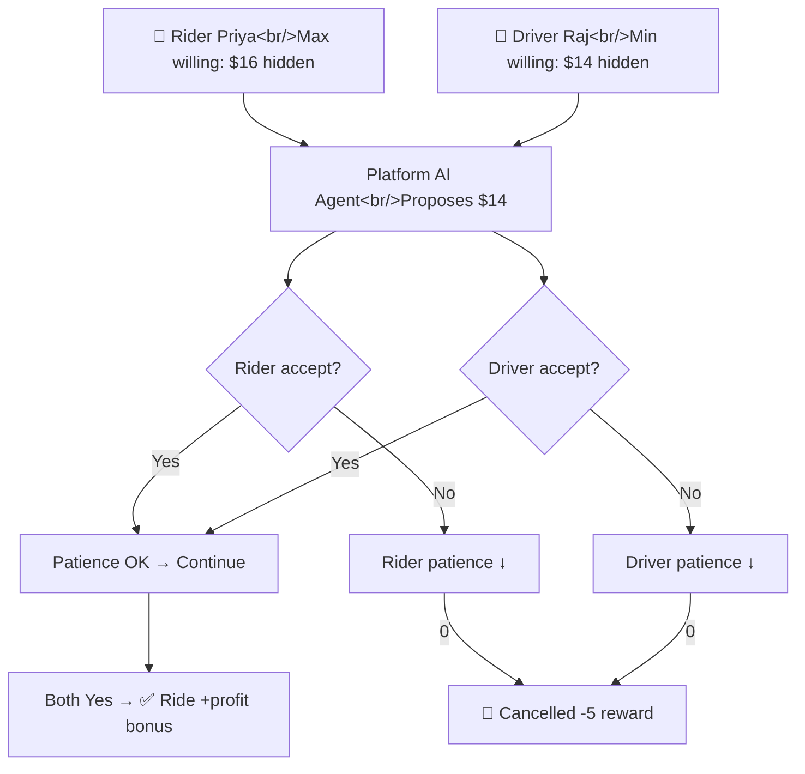

# Fairer, Faster, More Profitable Ride Matching

## The Real-World Problem
Imagine: Rainy rush hour. Rider **Priya** quotes $12, driver **Raj** wants $18. Platform **UberX** surge-prices to $20 — **Raj accepts, Priya cancels**. Lost ride, frustrated users, empty car.

**Current systems fail** because:
- Surge multipliers are **blunt** — punish riders, don't negotiate
- No modeling of **individual patience/urgency** 
- **No strategic adaptation** — drivers learn to hold out, riders walk away
- Platforms lose **$billions** in unmatched supply-demand

**Who benefits?** Platforms (higher profit/ride), riders/drivers (fairer prices, fewer cancellations).

## The AI Negotiation System

**Entities:**
- **Platform Agent** (Qwen2.5-1.5B LoRA): Learns to propose prices balancing speed +
